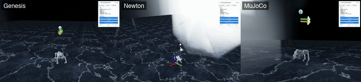
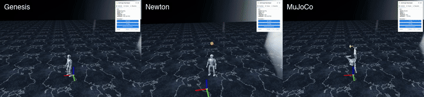
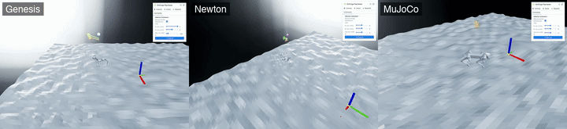

# SimForge

A JAX-based reinforcement learning framework for legged-robot locomotion,
with first-class support for training and evaluating **one policy across
three simulators** — [Genesis][genesis], [Newton][newton], and MuJoCo
(via [mjlab][mjlab]) — using a single sim-agnostic API. The framework
itself is `jaxrlworld/` inside [`JaxRLWorld/`](JaxRLWorld); `SimForge/` is the
umbrella repo that pins specific simulator versions as git submodules so
external users can clone a single, reproducible stack.

<p align="center">
  
</p>

<p align="center">
  <em>One PPO policy trained on <code>go2/newton/gait_conditioned</code>, evaluated across all three simulators.</em>
</p>

<p align="center">
  
</p>

<p align="center">
  <em>One PPO policy trained on <code>t1_getup</code> in Genesis, evaluated across all three simulators.</em>
</p>

<p align="center">
  
</p>

<p align="center">
  <em>One PPO policy trained on <code>go2/newton/rough</code> (rough terrain), evaluated across all three simulators.</em>
</p>

## Highlights

- **Proxy for sim-to-real research.** Cross-sim provides a
  hardware-free testbed for sim2real-style experiments (e.g., system
  identification). The same task config drives all three backends.
- **9 task configurations × 3 simulators = 27 ready combinations**
  covering Unitree G1 (29-DOF humanoid), Unitree Go2 (quadruped), and
  the Booster T1 and K1 humanoids.
- **PPO is the default for all locomotion tasks** across the three
  simulators. **PPO, SAC and TD3** are checked against
  [Stable-Baselines3][sb3] on six Gymnasium MuJoCo tasks under identical
  settings — see [Benchmarks](#benchmarks). **FastTD3 and TDMPC2** are
  validated on the same Gymnasium suite, FastTD3 additionally on
  [mujoco_playground][mjpg].
- **Domain randomization, motion tracking, and viser-based 3-D
  visualization** are wired up across all simulators.

## Supported tasks

The table below lists (task, simulator) combinations that have been
trained and evaluated end-to-end with PPO.

|                              | Robot        | Genesis | Newton | MuJoCo |
| ---------------------------- | ------------ | :-----: | :----: | :----: |
| `g1_29dof`                   | Unitree G1   | ✓       | ✓      | ✓      |
| `g1_tracking`                | Unitree G1   | ✓       | ✓      | ✓      |
| `go2` (flat, MLP baseline)   | Unitree Go2  | ✓       | ✓      | ✓      |
| `go2` (rough terrain)        | Unitree Go2  | ✓       | ✓      | ✓      |
| `go2` (gait-conditioned)     | Unitree Go2  | ✓       | ✓      | ✓      |
| `t1_getup`                   | Booster T1   | ✓       | ✓      | ✓      |
| `t1_tracking`                | Booster T1   | ✓       | ✓      | ✓      |
| `k1_joystick`                | Booster K1   | ✓       | ✓      | ✓      |
| `k1_joystick` (g1 recipe)    | Booster K1   | ✓       | ✓      | ✓      |

## Benchmarks

The locomotion tasks above have no external reference to check against,
so the algorithms are validated against [Stable-Baselines3][sb3] on
Gymnasium MuJoCo instead: same environment, same network, same
hyperparameters, same budget, three seeds each.

Return after the budget, averaged over seeds 0/1/2:

**PPO** — 1000 iterations x 16 envs x 128 steps = 2.05M environment steps

| Task           | JaxRLWorld | SB3    |
| -------------- | ---------: | -----: |
| HalfCheetah-v5 |     1555.4 | 1550.0 |
| Hopper-v5      |     2042.7 | 2113.3 |
| Walker2d-v5    |     1714.4 | 1696.3 |
| Ant-v5         |     2129.2 | 1225.3 |
| Humanoid-v5    |      513.2 |  488.3 |
| Swimmer-v5     |       68.6 |   69.9 |

**SAC** — 100k environment steps, one gradient step each

| Task           | JaxRLWorld | SB3    |
| -------------- | ---------: | -----: |
| HalfCheetah-v5 |     1912.6 | 1664.0 |
| Hopper-v5      |      871.5 |  479.7 |
| Walker2d-v5    |      727.2 |  564.7 |
| Ant-v5         |      446.0 |  362.3 |
| Humanoid-v5    |      769.7 |  661.7 |
| Swimmer-v5     |       34.5 |   37.1 |

**TD3** — 100k environment steps, one gradient step each

| Task           | JaxRLWorld | SB3    |
| -------------- | ---------: | -----: |
| HalfCheetah-v5 |     1414.3 | 1054.7 |
| Hopper-v5      |      437.0 |  312.7 |
| Walker2d-v5    |     1082.4 |  540.3 |
| Ant-v5         |      954.6 | 1086.3 |
| Humanoid-v5    |      111.8 |  174.9 |
| Swimmer-v5     |       25.3 |   31.9 |

Hyperparameters are SB3's defaults on both sides, untuned per task, so
this is a parity check rather than a ranking — at three seeds and these
budgets the spread is wide. Everything held equal is pinned in
[`_common.py`][bench].

```bash
# one cell
bash JaxRLWorld/jaxrlworld/scripts/benchmark/sb3_compare/ppo_halfcheetah.bash
# every algorithm x task, resumable
bash JaxRLWorld/jaxrlworld/scripts/benchmark/sb3_compare/sweep.bash
```

## Installation

JaxRLWorld pins specific versions of [Genesis][genesis], [Newton][newton],
and [mjlab][mjlab] as git submodules under this `SimForge/` repo.

### 1. Clone with submodules

```bash
git clone --recurse-submodules https://github.com/jsw7460/SimForge.git
cd SimForge
# or, if already cloned: git submodule update --init
```

### 2. Create a conda env

Python >= 3.11 is required.

```bash
conda create -n jrw python=3.11 -y
conda activate jrw
```

Any other env manager (`venv`, `uv`, `pyenv`) works too — just make
sure you are running inside a clean, isolated Python and that the
later steps install into that same env.

### 3. Install the simulators (editable, from submodules)

Each simulator has its own install notes — consult its README for CUDA
and system prerequisites. Typically:

```bash
pip install -e Mjlab/
pip install -e Newton/
pip install -e Genesis/
```

### 4. Install JaxRLWorld and JAX-CUDA

```bash
pip install -e "JaxRLWorld/[all]"
pip install -U "jax[cuda12]"   # match your system CUDA
```

> CUDA versions across JAX, Genesis, and Newton's [Warp][warp] backend
> must be mutually compatible — consult each simulator's docs.

## Quickstart

Train PPO on Go2 gait-conditioned locomotion in Newton:

```bash
python JaxRLWorld/jaxrlworld/scripts/go2/newton/gait_conditioned.py
```

The same task in Genesis or MuJoCo:

```bash
python JaxRLWorld/jaxrlworld/scripts/go2/genesis/gait_conditioned.py
python JaxRLWorld/jaxrlworld/scripts/go2/mujoco/gait_conditioned.py
```

## Cross-sim evaluation

`eval_cross_sim.py` is the single entry point for evaluating any
checkpoint on any simulator. The robot, observation, algorithm, and
network configs are auto-detected from the checkpoint, so you only
specify which simulator to roll out on. Without `--eval`, the script
launches an interactive viser-based viewer; with `--eval`, it runs
batched statistics.

Training writes checkpoints to
`./outputs/models/<date>/<time>/checkpoint_latest/` by default. Pass
that directory to `--policy_path`:

```bash
python JaxRLWorld/jaxrlworld/scripts/evaluation/eval_cross_sim.py \
    --policy_path outputs/models/<date>/<time>/checkpoint_latest/ \
    --eval_sim mujoco
```

To pull a checkpoint from W&B instead, set `--policy_path None` and
provide `--wandb_run_path`:

```bash
python JaxRLWorld/jaxrlworld/scripts/evaluation/eval_cross_sim.py \
    --policy_path None \
    --wandb_run_path <entity>/<task>/<run-id> \
    --eval_sim mujoco \
    --eval
```

The W&B path is only resolvable if the training run uploaded its
checkpoint. Enable that either in your runner config or as a CLI
override:

```bash
python JaxRLWorld/jaxrlworld/scripts/g1_29dof/genesis/mlp.py \
    runner.upload_checkpoint=True
```

`--eval_sim` accepts `genesis`, `newton`, or `mujoco`.

## Acknowledgements

- **Environment / scene design** — the manager, scene, observation,
  command, event, and randomization abstractions follow conventions
  established by [IsaacLab][isaaclab] and [mjlab][mjlab]. We borrowed
  liberally from their designs while porting the runtime to JAX.
- **RL framework backbone and PPO** — adapted from
  [RSL_RL][rsl_rl] (ETH Robotic Systems Lab), which served as the
  reference implementation for our on-policy training loop and PPO
  update.
- **FastTD3** — JAX port adapted from the authors' original
  implementation: [FastTD3][fasttd3].
- **TDMPC2** — JAX port adapted from the authors' original
  implementation: [TD-MPC2][tdmpc2].


[genesis]: https://github.com/Genesis-Embodied-AI/Genesis
[newton]: https://github.com/newton-physics/newton
[mjlab]: https://github.com/mujocolab/mjlab
[isaaclab]: https://github.com/isaac-sim/IsaacLab
[rsl_rl]: https://github.com/leggedrobotics/rsl_rl
[fasttd3]: https://github.com/younggyoseo/FastTD3
[tdmpc2]: https://github.com/nicklashansen/tdmpc2
[mjpg]: https://github.com/google-deepmind/mujoco_playground
[warp]: https://github.com/NVIDIA/warp
[sb3]: https://github.com/DLR-RM/stable-baselines3
[bench]: JaxRLWorld/jaxrlworld/scripts/benchmark/sb3_compare/_common.py
